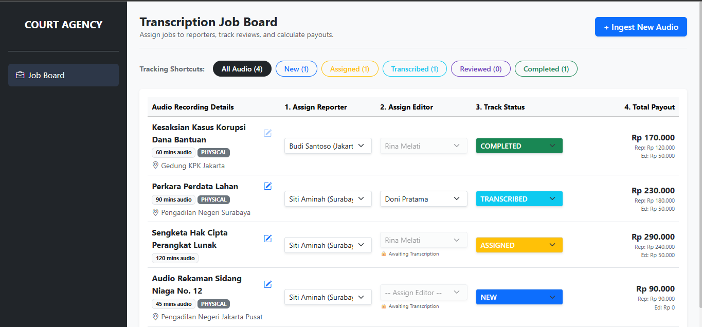

A clean, responsive single-page web panel built to give operational coordinators instant visual management over active court cases.
## 📸 Preview

🚀 Getting Started
1. Installation
Navigate to the frontend directory and install the UI dependencies:
    ``` bash
    cd frontend
    npm install
    ```

2. Vendor Asset Verification
This application relies on standard Bootstrap styling and semantic vector glyphs. Ensure your `frontend/index.html` file includes the remote stylesheet provider for Bootstrap icons within the `<head>` block:
    ``` html
    <link rel="stylesheet" href="https://cdn.jsdelivr.net/npm/bootstrap-icons@1.11.3/font/bootstrap-icons.min.css">
    ```
  
3. Launching Development Server
Fire up the local build server:
    ``` bash
    npm run dev
    ```
Open your browser to the designated local port (usually http://localhost:5173) to view the operational workspace.

### 🧩 Core UI Components Architecture

* App.tsx: The top-level state controller. Orchestrates network queries, atomic API dispatches, global caching, and synchronization routines.

* FilterTags.tsx: An accessibility-compliant shortcut tracking menu. Renders distinct, interactive contextual tags displaying real-time job counters per status phase rather than utilizing confusing abstract structural cards.

* JobTable.tsx & JobRow.tsx: Highly scannable, data-dense tabular display layout. Enforces reactive UI adjustments:

    * Proximity Engine (Rule 2): Flags local personnel options with a [📍 Preferred City] visual tag when physical room locations overlap with a reporter's home base.

    * Workflow Interceptor (Rule 3): Disables selection controls on the editor drop-down and displays a lock icon (🔒 Awaiting Transcription) until reporter file updates are confirmed.

* JobModal.tsx: Context-aware unified input form. Smoothly shifts titles and internal state variables to handle "New Audio Ingestion Mode" or "Edit Job Mode" depending on active dashboard user selections.

### ⚖️ Core Legal Operations Rules Reference

#### Rule 2: Reporter Assignment Mechanics
* Availability Wall: Overbooked or off-duty reporters (availability: false) are programmatically grayed out in option menus and blocked by backend database layers.

* Location Flexibility: Physical assignments actively suggest local talent via proximity checks, while virtual or REMOTE location categories lift restrictions for distributed assignment models.

#### Rule 3: Editor Assignment Mechanics
* Strict Order Operations: Editors review pre-transcribed work. Selection inputs remain inaccessible until the status reaches TRANSCRIBED.

* Review Tracking Sequence: Transition keys to change status to REVIEWED require a non-null editor entity attached to the dataset, establishing a transparent chain of custody for legal documents.